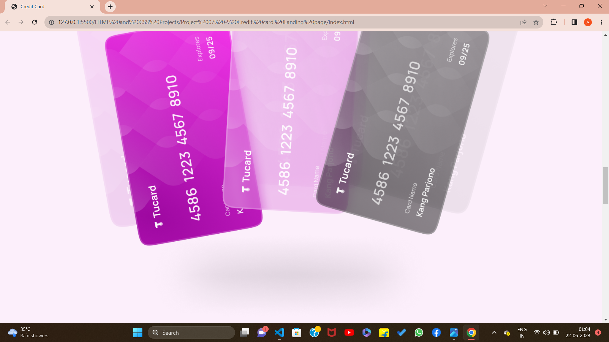
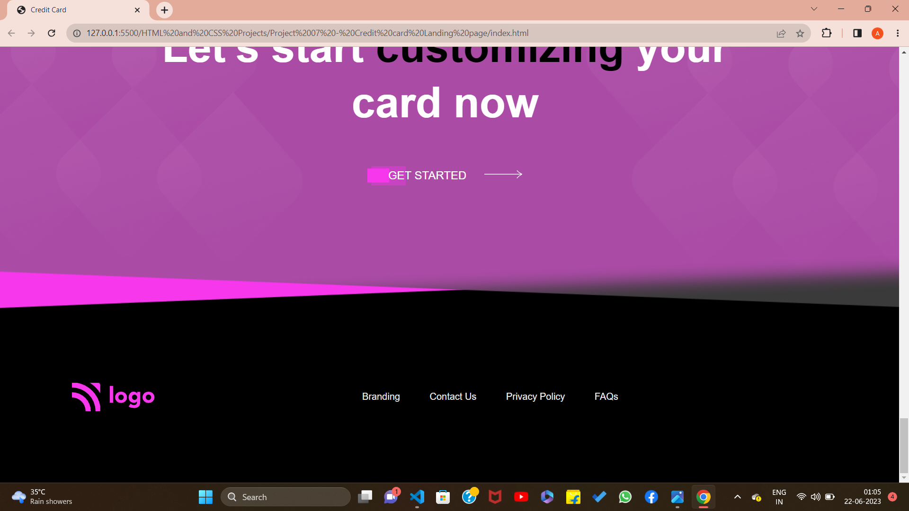

## PROJECT 07:  **CREDIT CARD LANDING PAGE**  

✏️TOOLS USED: HTML & CSS 
📂[FOLDER LINK](https://github.com/imankitadas/Fullstack-Javascript-Projects-2023/tree/main/02_HTML%20and%20CSS%20Projects/Project%2007%20-%20Credit%20card%20Landing%20page) 
🌐[LIVE LINK](https://64e9a8e2067a02144a26a701--statuesque-lily-eb2ec4.netlify.app/) 

**Welcome** to my Seventh project where I showcase my skills in HTML and CSS. 
OUTPUTS ACHIEVED :   

As always, I'm open to feedback and suggestions for improvement. If you have any comments or questions, don't hesitate to reach out. And don't forget to give credit where credit is due - this project was created by Ankita Das.

