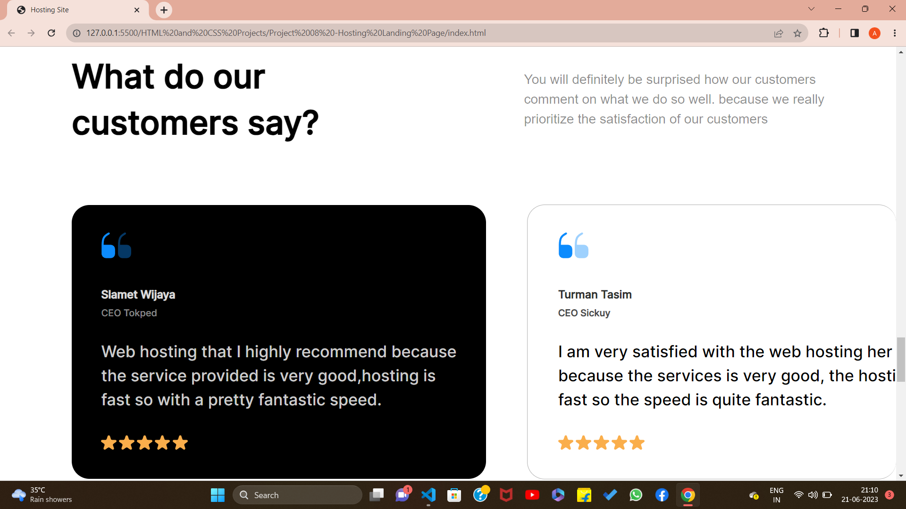

<<<<<<< HEAD:HTML and CSS Projects/Project 08 -Hosting Landing Page/readme.md
## PROJECT 08 :  **HOSTING SITE LANDING PAGE** 
=======
## PROJECT 02 :  **HOSTING SITE LANDING PAGE** 
>>>>>>> fd88a2dc1bf80f71a2c157a832420f2f81a0c681:HTML and CSS ExtraProjects/Project 02 -Hosting Landing Page/readme.md

✏️TOOLS USED: HTML & CSS 
📂[FOLDER LINK](https://github.com/imankitadas/Fullstack-Javascript-Projects-2023/tree/main/HTML%20and%20CSS%20Projects/Project%2008%20-Hosting%20Landing%20Page) 
🌐[LIVE LINK](http://127.0.0.1:5500/HTML%20and%20CSS%20Projects/Project%2008%20-Hosting%20Landing%20Page/index.html) 

<<<<<<< HEAD:HTML and CSS Projects/Project 08 -Hosting Landing Page/readme.md
**Welcome** to my eighth project where I showcase my skills in HTML and CSS. 
=======
**Welcome** to my second project where I showcase my skills in HTML and CSS. 
>>>>>>> fd88a2dc1bf80f71a2c157a832420f2f81a0c681:HTML and CSS ExtraProjects/Project 02 -Hosting Landing Page/readme.md
OUTPUTS ACHIEVED :  

 

As always, I'm open to feedback and suggestions for improvement. If you have any comments or questions, don't hesitate to reach out. And don't forget to give credit where credit is due - this project was created by Ankita Das.

