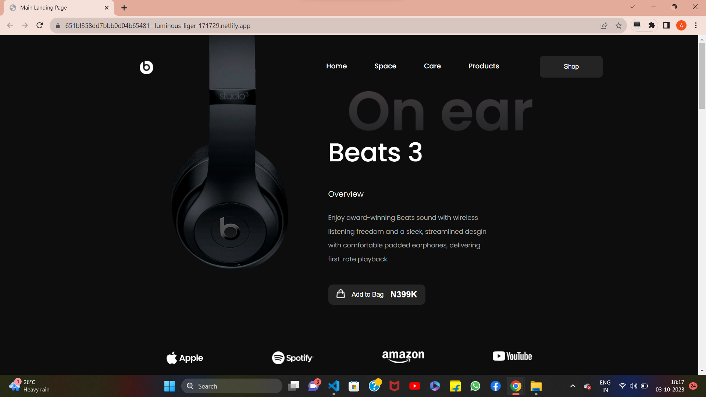
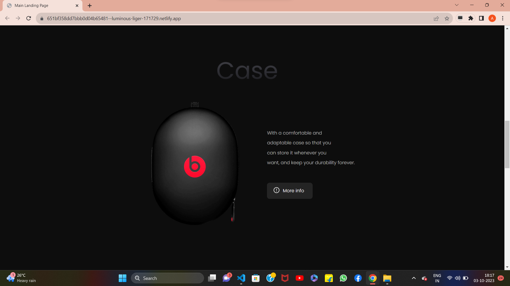
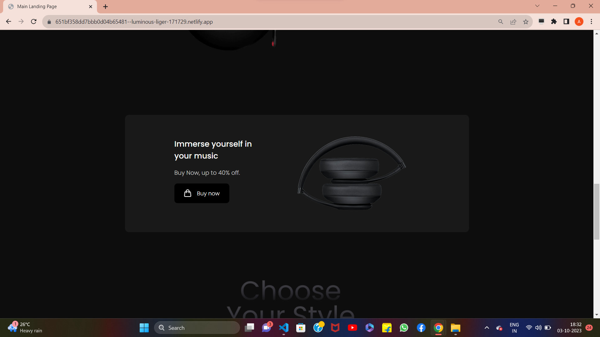
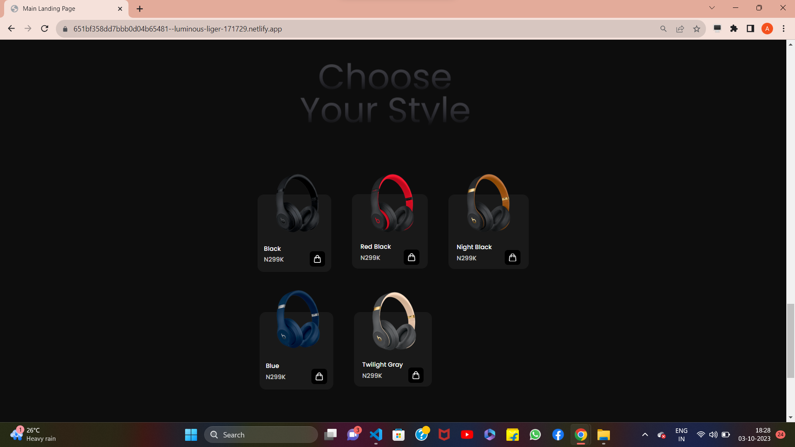
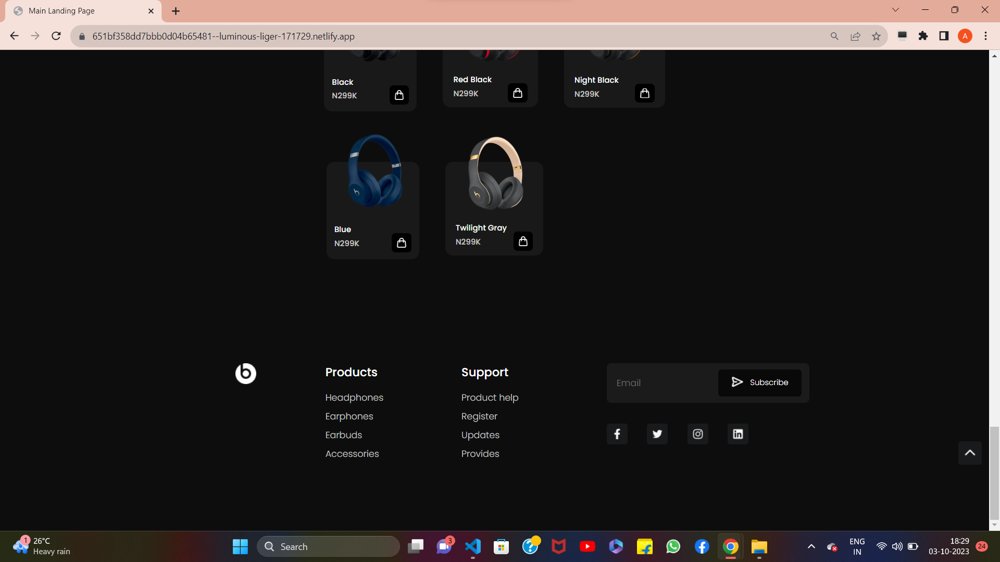

## PROJECT 11 :  **MAIN LANDING PAGE** 

✏️TOOLS USED: HTML & CSS 
📂[FOLDER LINK](https://github.com/imankitadas/Fullstack-Javascript-Projects-2023/tree/main/HTML%20and%20CSS%20Projects/Project%2011%20-%20Main%20Landing%20Page) 
🌐[LIVE LINK](https://651bf358dd7bbb0d04b65481--luminous-liger-171729.netlify.app/) 

**Welcome** to my Eleventh project where I showcase my skills in HTML and CSS.  

OUTPUTS ACHIEVED :  

 

As always, I'm open to feedback and suggestions for improvement. If you have any comments or questions, don't hesitate to reach out. And don't forget to give credit where credit is due - this project was created by Ankita Das.

